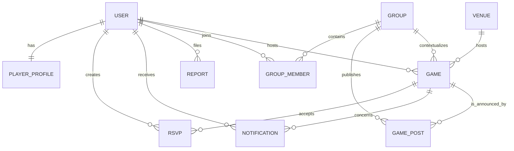

# PicklePlay Community MVP

## Product focus

PicklePlay’s first release is a **local player-community product**, not a facility operating system or a new rating authority. The core member journey is simple: discover a nearby court or game, understand whether the session is a good and safe fit, RSVP with a reliable capacity state, and participate in a local group. This combines the player-facing discovery and organizer workflows visible in products such as Pickleheads and Reclub while deliberately avoiding a broad operational surface. [Pickleheads](https://www.pickleheads.com/) emphasizes games, courts, local groups, organizer play, and structured activities, while [Reclub](https://reclub.co/) demonstrates the value of joining activities, membership coordination, attendance, and community conversation in one place.

The MVP treats self-described skill as a player-controlled matching aid. It may show an optional provenance label such as “self-described” or “linked provider,” but it neither computes a proprietary rating nor treats an unverified value as authoritative. This distinction reflects the separate roles of a rating, a ranking, and a verified provider-managed match history described by [USA Pickleball](https://usapickleball.org/skill-level/ratings/) and [DUPR](https://www.dupr.com/how-it-works).

## Deliberate product boundary

| Included now | Deferred deliberately | Why it is deferred |
|---|---|---|
| Player profiles, self-described skill bands, profile visibility, and rating provenance labels | Rating calculation and rating-provider synchronization | Provider contracts, consent, dispute flows, and reliability semantics need dedicated product and legal validation. |
| Local venue and game discovery, group context, organizer-created posts, RSVP capacity, and waitlists | Facility reservations, memberships, access control, and point of sale | Mature facility platforms such as [CourtReserve](https://courtreserve.com/) operate across booking, memberships, billing, access, and reporting; this is a distinct operator product surface. |
| In-app confirmation, waitlist-promotion, and organizer-update notifications | Payment collection, refunds, taxes, and credits | Financial workflows require a payment provider, reconciliation design, support policies, and compliance work. |
| Beginner-friendly activity labels, report entry points, community guidelines, and privacy controls | Tournaments, ladders, brackets, sanctioned competition, and official scoring | Rulesets change, formats vary, and official competition may depend on governing-body and provider requirements. [USA Pickleball’s rulebook](https://usapickleball.org/rules/) is updated annually. |
| Group- and game-scoped coordination, hosted updates, and in-app reporting | Open social feeds, follower graphs, public activity timelines, and short-form media publishing | Expand only after launch-market trust metrics show reliable moderation response times, a documented anti-harassment policy, clear audience/visibility controls, and enough community density to avoid empty or unsafe feeds. |
| Text-first game and group updates | Photo, video, and user-generated media uploads | Expand only after implementing consent-aware media rights, safety review tooling, abuse escalation, storage retention, accessibility requirements such as captions and alt text, and an operating budget for moderation and storage. |

## Authorization scopes

The system begins with a global application role and narrows authority through object ownership and membership. A player owns their profile, RSVPs, report submissions, and notification settings. An organizer may create and update their own games and group posts. A group owner or moderator can manage group membership and group-level posts. A community moderator can review reports. A platform admin can handle system-level governance. These roles are deliberately separate from facility administration and payment authority, which are out of scope for this release.

| Role | Global scope | Group scope | Game scope |
|---|---|---|---|
| Player | Manage own profile, privacy, RSVPs, reports, and notifications | Join public groups and view eligible group activity | Discover, RSVP, leave, and report games subject to visibility rules |
| Organizer | Player permissions plus own organizer profile context | Own or moderate assigned groups | Create and update own games and posts; view attendance for hosted games |
| Community moderator | Review assigned safety reports | Moderate assigned group content | Review reports about associated games and posts |
| Platform admin | Govern user roles, support, and escalation | Override moderation when necessary | Audit high-risk actions and resolve safety escalations |

## MVP domain model

Each RSVP is unique for a player and game, and it has one of two active states: `confirmed` or `waitlisted`. The backend locks the game record within an RSVP transaction, counts confirmed guests, and creates a confirmed RSVP only when capacity remains. When a confirmed attendee leaves, the longest-waiting active RSVP is promoted and receives an in-app notification. The application leaves rating, payment, and tournament records absent rather than representing them with nonfunctional placeholders.

## Research-informed roadmap

| Phase | Objective | Scope | Excluded until a later phase |
|---|---|---|---|
| 1. Community wedge | Establish repeat player value locally | Profiles, venues, games, groups, posts, capacity-aware RSVPs, waitlists, and trust controls | Payments, reservations, direct messaging, ratings integrations, and tournaments |
| 2. Organizer utility | Reduce the operational work of recurring local play | Recurring activity templates, organizer attendance views, announcements, richer moderation queues, and notification preferences | Financial settlement, club memberships, facility access, and sanctioned competition |
| 3. Facility collaboration | Connect the player network with venue supply | Availability imports, facility claims, partner integrations, and venue-aware programming | In-house full reservation stack unless a validated supply-side case requires it |
| 4. Competition and ecosystem | Expand into structured play only with policy and partner clarity | Versioned score records, provider-consented integrations, and organizer competition tooling | A proprietary rating model or any claim of official sanction without governing-body approval |

## Explicit expansion decision gates

Social feeds require evidence that the launch community has sustainable activity, clear audience controls, staffed response expectations for reports, and measurable safety outcomes before a public feed, follower graph, or discoverable activity timeline is enabled. Media uploads require a separate review because they introduce rights management, consent, storage retention, accessibility, and abuse-review obligations; text-only community coordination remains the default until those controls are operational.

Facility reservations, memberships, payment collection, and credits require a validated venue-partner need, a documented operator workflow, and a selected provider or reconciliation model before implementation. Rating-provider synchronization requires user consent, a provider agreement, dispute and correction semantics, and a clear statement that PicklePlay is not calculating an authoritative rating. Competition features require a versioned format and scoring model, organizer responsibility rules, and—where relevant—governing-body or sanctioning approval before any official claims are shown.

## Safety and privacy principles

Location is expressed as a venue or neighborhood rather than a continuous player location. Personal profiles can limit visibility to nearby community members or trusted contexts, and reports are always available from games, posts, and profiles. Beginner labels communicate intended experience and norms; they should never be used to stigmatize, expose, or rank people. In-app notifications are event-based and persistent, while outbound email remains a future opt-in delivery layer requiring notification preferences and an approved email service.
